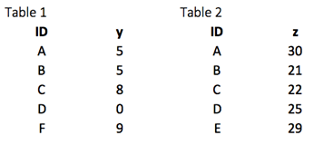
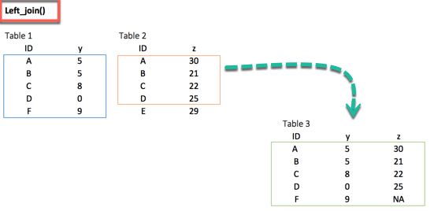
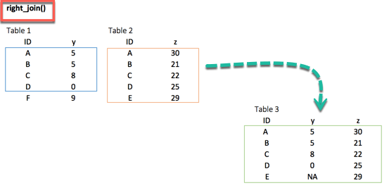
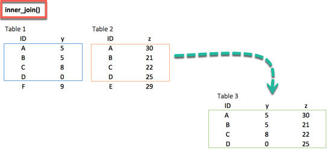
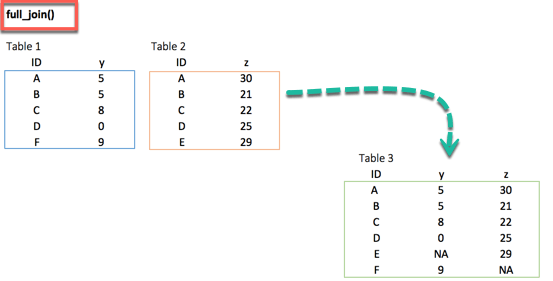
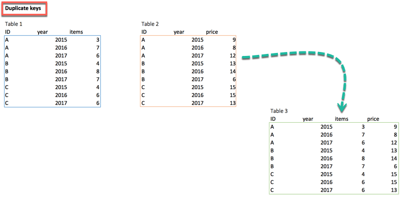
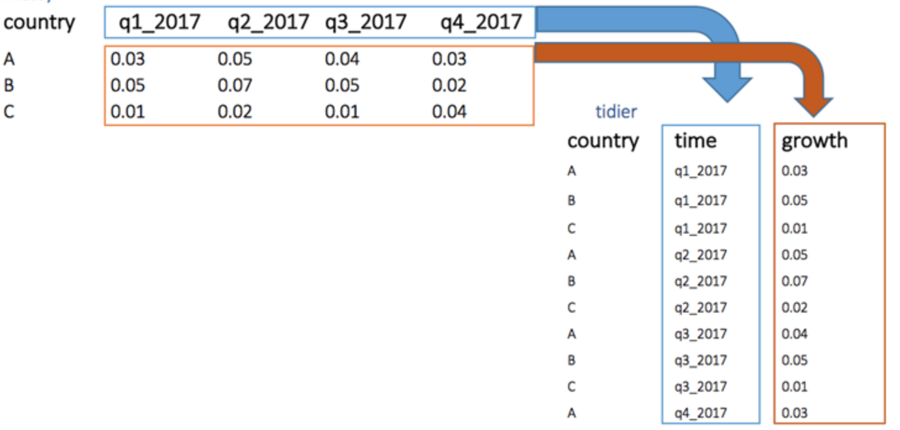

# Tutorial: Reshaping Data

Data analysis typically involves three phases:

1. **Extraction** - Collecting and combining data from multiple sources
2. **Transform** - Cleaning and manipulating data into the right format
3. **Visualize** - Checking for patterns and irregularities

This tutorial covers the Transform phase, specifically reshaping data between wide and long formats.

## Core Functions

- `gather` - Wide to long (unpivot)
- `spread` - Long to wide (pivot)
- `separate` - Split one column into multiple
- `unite` - Combine multiple columns into one

## Joining Data

CrysDA supports four join types, similar to SQL:

### Setup



```crystal
df_primary = Crysda.dataframe_of("ID", "y").values(
  "A", 5,
  "B", 5,
  "C", 8,
  "D", 0,
  "F", 9
)

df_secondary = Crysda.dataframe_of("ID", "z").values(
  "A", 30,
  "B", 21,
  "C", 22,
  "D", 25,
  "E", 29
)
```

### left_join

Keeps all rows from the left table. Unmatched rows get `NA` for right-side columns.



```crystal
df_primary.left_join(df_secondary, "ID").print
```

```
    ID   y      z
1    A   5     30
2    B   5     21
3    C   8     22
4    D   0     25
5    F   9   <NA>
```

### right_join

Keeps all rows from the right table.



```crystal
df_primary.right_join(df_secondary, "ID").print
```

```
    ID      y    z
1    A      5   30
2    B      5   21
3    C      8   22
4    D      0   25
5    E   <NA>   29
```

### inner_join

Only keeps rows that match in both tables.



```crystal
df_primary.inner_join(df_secondary, "ID").print
```

```
    ID   y    z
1    A   5   30
2    B   5   21
3    C   8   22
4    D   0   25
```

### outer_join

Keeps all rows from both tables, filling `NA` where needed.



```crystal
df_primary.outer_join(df_secondary, "ID").print
```

```
    ID      y      z
1    A      5     30
2    B      5     21
3    C      8     22
4    D      0     25
5    E   <NA>     29
6    F      9   <NA>
```

### Multiple Key Columns



```crystal
df_primary = Crysda.dataframe_of("ID", "year", "items").values(
  "A", 2015, 3,
  "A", 2016, 7,
  "B", 2015, 4,
  "B", 2016, 8
)

df_secondary = Crysda.dataframe_of("ID", "year", "prices").values(
  "A", 2015, 9,
  "A", 2016, 8,
  "B", 2015, 13,
  "B", 2016, 14
)

df_primary.left_join(df_secondary, by: ["ID", "year"]).print
```

```
    ID   year   items   prices
1    A   2015       3        9
2    A   2016       7        8
3    B   2015       4       13
4    B   2016       8       14
```

## Reshaping: Wide ↔ Long

### gather (Wide to Long)

Convert multiple columns into key-value pairs.



```crystal
df = Crysda.dataframe_of("country", "q1_2017", "q2_2017", "q3_2017", "q4_2017").values(
  "A", 0.03, 0.05, 0.04, 0.03,
  "B", 0.05, 0.07, 0.05, 0.02,
  "C", 0.01, 0.02, 0.01, 0.04
)

df.gather("quarter", "growth", Crysda.selector { |c| c["q1_2017".."q4_2017"] }).print
```

```
     country   quarter   growth
 1         A   q1_2017    0.030
 2         B   q1_2017    0.050
 3         C   q1_2017    0.010
 4         A   q2_2017    0.050
 5         B   q2_2017    0.070
 6         C   q2_2017    0.020
...
```

### spread (Long to Wide)

Convert key-value pairs back to columns.

```crystal
long_df.spread("quarter", "growth").print
```

```
    country   q1_2017   q2_2017   q3_2017   q4_2017
1         A     0.030     0.050     0.040     0.030
2         B     0.050     0.070     0.050     0.020
3         C     0.010     0.020     0.010     0.040
```

## Splitting & Combining Columns

### separate

Split a column by delimiter.

```crystal
df.separate("quarter", into: ["qtr", "year"], sep: "_").print
```

```
     country   growth   qtr   year
 1         A    0.030    q1   2017
 2         B    0.050    q1   2017
...
```

### unite

Combine columns with a delimiter.

```crystal
df.unite("quarter", ["qtr", "year"], sep: "_").print
```

```
     country   growth   quarter
 1         A    0.030   q1_2017
...
```
